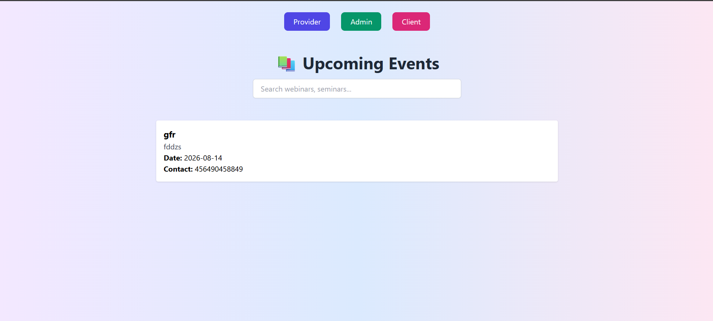
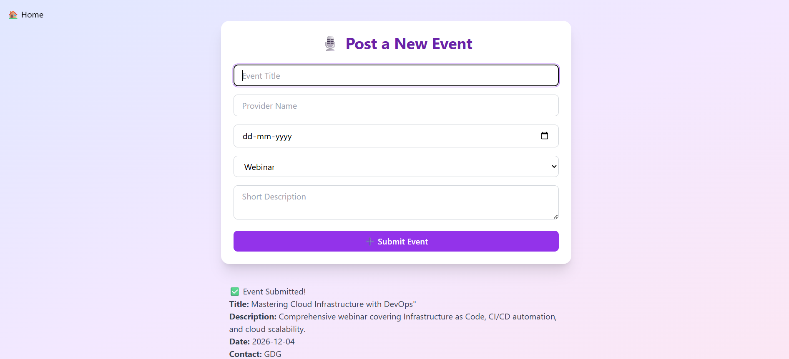
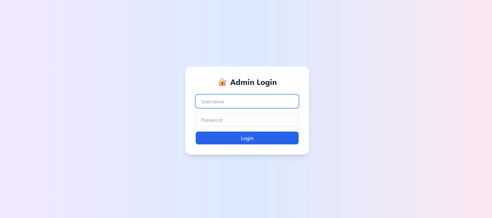

# 🎉 Event Management System

A full-stack Event Management System that allows event providers to submit events, admins to approve or reject them, and users to browse approved events. The application is built using Node.js, Express.js, MongoDB Atlas, and deployed on Render.

## 🚀 Live Demo

🌐 https://event-management-system-xo60.onrender.com

---

## 📌 Features

### 👤 User
- View approved events
- Browse event details
- Responsive interface

### 📝 Event Provider
- Submit new events
- Fill event details including title, description, category, date, and contact
- Events remain pending until approved

### 🔐 Admin
- Secure admin login
- View all pending events
- Approve or reject event requests
- Manage event listings

---

## 🛠️ Tech Stack

### Frontend
- HTML5
- CSS3
- JavaScript

### Backend
- Node.js
- Express.js

### Database
- MongoDB Atlas
- Mongoose

### Deployment
- Render

### Version Control
- Git & GitHub

---

## 📂 Project Structure

```
event-management-system/
│
├── models/
│   └── Event.js
│
├── public/
│   ├── index.html
│   ├── provider.html
│   ├── admin.html
│   ├── clients.html
│   ├── css/
│   ├── js/
│
├── server.js
├── package.json
├── .env.example
└── README.md
```

---

## ⚙️ Installation

Clone the repository

```bash
git clone https://github.com/DHANYA305/event-management-system.git
```

Move into the project folder

```bash
cd event-management-system
```

Install dependencies

```bash
npm install
```

Create a `.env` file

```env
MONGO_URI=your_mongodb_connection_string
PORT=5003
```

Start the server

```bash
npm start
```

Visit

```
http://localhost:5003
```

---

## 🌍 Deployment

The project is deployed on Render and uses MongoDB Atlas as the cloud database.

---

## 📸 Screenshots

### Home Page

(Add Screenshot)

### Provider Dashboard

(Add Screenshot)

### Admin Dashboard

(Add Screenshot)

---

## 🔄 Workflow

```
Provider
     │
     ▼
Submit Event
     │
     ▼
Node.js + Express API
     │
     ▼
MongoDB Atlas
     │
     ▼
Pending Events
     │
     ▼
Admin Approval
     │
     ▼
Approved Events
     │
     ▼
Displayed to Users
```

---

## 📦 API Endpoints

| Method | Endpoint | Description |
|---------|----------|-------------|
| GET | /events | Fetch approved events |
| POST | /events | Submit a new event |
| GET | /pending | Get pending events |
| POST | /approve | Approve an event |
| POST | /reject | Reject an event |
| POST | /login | Admin login |

---


## 📸 Screenshots

### Home Page



### Provider Dashboard



### Admin Dashboard



### Approved Events


## ✨ Future Enhancements

- User authentication
- Event registration
- Email notifications
- Image uploads
- Search & Filters
- Dashboard analytics
- Role-based access control

---

## 👩‍💻 Author

**Dhanya**

Backend Developer | CSE Student

GitHub:
https://github.com/DHANYA305


---

## ⭐ Support

If you found this project useful, consider giving it a ⭐ on GitHub.
